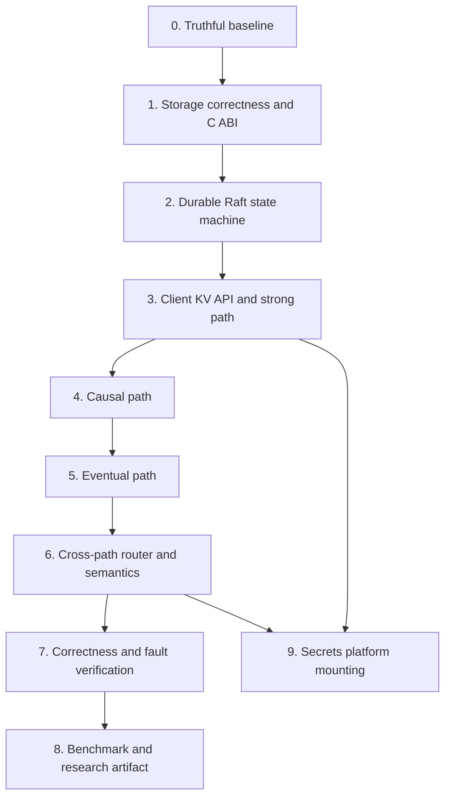

# Meridian Implementation Roadmap

**Status:** Client-visible strong, causal, and eventual paths work in a live three-node integration test. The test now includes identified-leader stop, replacement election, restart, and durable catch-up; correctness and measurement gates remain open. 
**Baseline:** `7db514c40c07fce68aa0794551830fd51a9224fd`, audited September 10, 2026; this roadmap reflects the September 11 working tree. 
**Purpose:** Build Meridian from separately tested components into a verifiable mixed-consistency key-value store, then layer the secrets platform on top. This document describes code status, implementation order, and completion criteria. [`research.md`](research.md) defines the research semantics and evidence required for Q1–Q3.

## Current State

| Area | Current code | Missing before research claims |
|---|---|---|
| Rust storage | WAL recovery, tombstones, atomic SSTable publication, compaction, C ABI, and 25 Rust tests | Interruption/crash stress, storage amplification instrumentation |
| Raft | Durable hard state/log snapshot, deterministic Rust-backed state machine, committed no-op read barrier, atomic follower suffix merge, serialized state-changing RPCs, and live three-node leader-stop/restart catch-up test | ReadIndex, snapshots/log truncation, durable de-duplication, model checking, failover history checking |
| Cluster | Separate peer/client gRPC ports, `Get`/`Put`/`Delete`/CAS/status API, and a public leader-aware Go client | Durable retry semantics and workload-based fault validation |
| Causal consistency | Context propagation, durable whole-replica snapshots, dependency queue, applied-Raft watermark, push replication, and sibling responses | Durable outbox/retry, policy installation through Raft, cross-path materialization, dependency timing metrics |
| Eventual consistency | Durable whole-replica snapshots, multi-value registers, immediate push, and 250 ms full-state anti-entropy | Digest-based anti-entropy, garbage collection, backpressure/lag metrics, partition/heal evidence |
| Shared namespace | Startup-configured immutable longest-prefix policies, request admission, and materialized strong versions for weak reads | Raft-installed metadata and independently delayed weak-path dissemination |
| Validation | Go/Rust race and unit tests; Rust-backed three-node client integration with leader stop/restart and durable catch-up; raw JSONL driver; bounded exhaustive checker for single-register strong histories | Large-history checker, workload-based fault scenarios, convergence/property tests under faults |
| Benchmarking | Closed-loop `meridian-load`, mixed-workload manifest, `netem` helper, five-trial development script | YCSB binding, open-loop scheduler, staleness oracle, external baselines, retained trials |
| Secrets platform | In-process secrets, policy, audit, anomaly, and metrics packages | Raft/state-machine mounting, authentication, encryption, WASM, client API, end-to-end behavior |

The plan has two tracks. **Track A** is the research-critical distributed key-value store. It is the only track that blocks Q1–Q3. **Track B** mounts the existing platform components after Track A has a correct client-visible core. A package with unit tests is not considered shipped until its behavior is reachable through the real client path and verified during faults.

## Architectural Decisions to Implement

These decisions prevent the missing components from being built with incompatible assumptions.

| Decision | Chosen design | Why it matters |
|---|---|---|
| Storage boundary | Rust remains the storage engine; Go accesses it through a small C ABI with owned byte buffers and explicit error codes. | Keeps one durable implementation while avoiding a second storage protocol in the client path. |
| Strong state machine | Raft commits typed commands; the apply loop invokes a deterministic state-machine interface and completes a per-command waiter only after durable application. | A local log append is not a successful client write. |
| Linearizable reads | Current implementation commits a no-op barrier and waits for local application; replace it with quorum-confirmed ReadIndex before performance evaluation. | Avoids relying on clock-bounded leader leases while recording the current implementation cost. |
| Namespace policy | A longest-prefix policy assigns an immutable write class: `strong`, `causal`, or `eventual`. Policies are startup-configured in the current build; Raft installation is required before online reconfiguration. | Stops two replication mechanisms from accepting writes for the same key. |
| Cross-path reads | Strong puts/deletes materialize a Raft-indexed record into both weak registers after local apply. | Lets weak reads carry their weaker served class without allowing a mixed write path. |
| Eventual conflict rule | Use a multi-value register backed by version vectors; retain maximal concurrent siblings until a resolving write. | Avoids hiding conflicts behind unsynchronized last-writer-wins timestamps. |
| Causal context | Clients carry both a version-vector frontier and the highest Raft index on which the operation depends. | Lets causal reads wait for dependencies committed by Raft. |
| Measurement record | Every client operation records scheduled, invoked, and completed time; class requested and served; dependencies; returned versions; and outcome. | Supports correctness checking, staleness measurement, and fault timelines from one raw history. |

An implementation change that alters one of these decisions requires a dated amendment to [`research.md`](research.md), new cross-path tests, and an explanation of how the invariant remains true.

## Track A — Mixed-Consistency Key-Value Store

### Phase 0 — Establish a truthful baseline

**Goal:** Make the code, design, and roadmap describe the same system.

- [x] Audit the executable code and record the result in [`research.md`](research.md).
- [x] Run the current Go race-test suite and Rust test suite.
- [x] Replace completion claims in this roadmap with the audited state.
- [ ] Review the remaining architecture, design, runbook, and README claims as each corresponding path is implemented; do not mark future functionality as working in advance.
- [x] Add CI jobs that run Go race tests, Rust tests, and the smallest real three-node integration test.

**Exit:** The roadmap's “Current State” table remains accurate after every merged phase. Documentation may describe target behavior only when labeled as target behavior.

### Phase 1 — Storage correctness and Go/Rust boundary

**Goal:** A process can use the Rust engine safely and data survives a verified crash/restart sequence.

- [x] Add a regression test for deleting a key, closing the engine, reopening it, and observing absence rather than an empty value.
- [x] Repair WAL replay so it preserves tombstones, including tombstones that shadow older SSTable entries.
- [x] Add atomic SSTable publication and directory synchronization before WAL reset. Interruption testing remains open.
- [x] Implement explicit all-table compaction that retains the newest live value or tombstone per key, with multi-table tests.
- [x] Reset the WAL only after its SSTable is durably published so ordinary flushes do not produce unbounded replay history.
- [x] Export a minimal Rust C ABI: open/close, put, get, delete, flush, compact, and free-buffer. No Rust pointer crosses the boundary without a paired free function.
- [x] Add a Go storage adapter with context-aware errors and integration tests against the real Rust static library.
- [ ] Add crash integration tests that write, overwrite, delete, flush, reopen, and verify every key.

**Exit:** A Go integration test writes 10,000 keys, overwrites and deletes a subset, terminates and reopens the storage process, then verifies the expected state. The test includes at least one flush and compaction. No key is read through an ad hoc duplicate storage implementation.

### Phase 2 — Durable Raft state machine

**Goal:** A committed command survives restart and changes the shared state machine exactly once.

- [x] Define a versioned command codec for put, delete, and compare-and-set. Namespace-policy and replication-metadata commands remain open.
- [x] Define a `StateStore` and `StateMachine` interface. The current atomic state store persists term and vote before vote responses.
- [x] Persist the Raft log, commit metadata, and last-applied index through an fsynced, atomically replaced state file. A segmented log store remains future work.
- [x] Replace log-only application with deterministic command decoding and a state-machine `Apply` call.
- [x] Add command result waiters. `SubmitAndWait` returns only after a committed entry is applied locally; it is not exposed as a client API yet.
- [x] Recover hard state, log, commit index, and last-applied state at node start; replay committed-but-unapplied entries through the state machine.
- [x] Test an identified leader stop, replacement election, restarted former-leader catch-up, and reads of acknowledged strong values in a real three-node process.
- [ ] Implement snapshot creation, installation, and log truncation only after recovery semantics pass without snapshots.
- [x] Remove debug-only request logging. Structured state-transition logs remain open.

**Exit:** In a real three-node process test, acknowledged commands survive a leader crash and restart. A command that was not acknowledged may be absent; an acknowledged command is present exactly once on every recovered node. The test retains client invocation and response intervals.

### Phase 3 — Client KV API and strong path

**Goal:** Clients can use a complete strong key-value API against the live cluster.

- [x] Define client protobuf messages for `Get`, `Put`, `Delete`, compare-and-set, status, consistency, causal context, request ID, and deadline fields.
- [x] Register a client service separately from peer Raft RPCs and listen on the configured client port.
- [x] Return typed retryable leader-unavailable responses and provide a leader-aware client. Durable mutation retry remains open.
- [x] Use a committed no-op barrier and wait for local application before a strong read responds. Replace it with quorum-confirmed ReadIndex before performance evaluation.
- [ ] Add durable request de-duplication so client retries cannot apply a successful write twice.
- [x] Implement typed invalid-argument, unavailable, deadline-exceeded, unimplemented, and internal RPC responses. Failed-precondition conflict responses remain open.
- [x] Add a small Go leader-aware client with a follower/leader routing test. It intentionally does not retry mutations without durable de-duplication.
- [x] Add a status RPC that reports node role, term, leader, commit index, last applied, and storage health.

**Exit:** A real client can put, get, delete, and compare-and-set through any node. Strong histories with concurrent clients pass the independent checker after leader failure and a 2+1 partition. The service, rather than container state, determines test success.

### Phase 4 — Causal consistency path

**Goal:** Causal keys preserve dependency order across replicas without a wide-area quorum on every operation.

- [x] Implement an immutable namespace-policy registry and admission matrix. Policies are startup-configured; Raft installation remains open.
- [x] Implement version-vector operations: increment, merge, dominance, equality, concurrency, stable encoding, and decoding. Replica-membership bounds remain open.
- [x] Implement a common causal/eventual record envelope, dependency-visibility predicate, and multi-value-register merge that preserves concurrent siblings.
- [x] Add client causal context propagation to successful reads and writes.
- [x] Define causal record envelopes containing value/tombstone, version vector, dependencies, origin, and policy version.
- [x] Implement causal replication messages, durable replica snapshots, duplicate suppression, and dependency wait queues. Durable outbox retry remains open.
- [x] Expose a causal value only when the local vector frontier and required Raft index dominate the client context.
- [ ] Implement timeout behavior for unavailable dependencies; never return a dependency-violating value as success.
- [ ] Add property tests with reordered, duplicated, and delayed messages, plus a real three-node dependency-chain test.

**Exit:** A client that reads `x`, writes dependent `y`, and later causally reads `y` cannot observe `y` without the version of `x` it depended on. Concurrent causal writes are exposed as concurrent versions, not silently serialized.

### Phase 5 — Eventual consistency and anti-entropy

**Goal:** Eventual namespaces remain locally writable during a partition and converge safely after healing.

- [x] Implement eventual record envelopes using the same version-vector representation as the causal path.
- [x] Implement local durable writes, immediate peer update batches, and duplicate suppression. Bounded retries and backpressure remain open.
- [x] Implement periodic full-state anti-entropy. Digest exchange and bounded transfer remain open.
- [x] Implement multi-value-register merge and tombstone propagation. Resolving writes and garbage-collection preconditions remain open.
- [x] Return observed versions and replication metadata on eventual reads; do not infer “fresh” from local wall-clock time alone.
- [ ] Track per-peer lag, pending bytes, last successful exchange, sibling count, and convergence time.
- [ ] Add partition/heal tests that verify convergence and preservation of concurrent siblings.

**Exit:** During a partition, writes to a predeclared eventual namespace succeed on both sides. After healing, every replica converges to the same maximal version set, and the raw history explains every returned version.

### Phase 6 — Cross-path router and semantic enforcement

**Goal:** The three paths share one namespace without making incompatible promises.

- [x] Implement longest-prefix namespace lookup and validate the policy version on writes.
- [x] Enforce same-path reads and writes by namespace class. Weaker reads of strong namespaces are admitted only after local materialization.
- [x] Materialize a locally applied strong version into causal and eventual registers with its Raft index. Independently delayed dissemination queues remain open.
- [ ] Extend client context so a causal request depending on a Raft operation waits for the required local applied index.
- [x] Implement causal and eventual reads of a strong key as explicitly weaker responses. Independent weak-path propagation delay remains open.
- [ ] Reject concurrent strong and eventual writes to one key before mutation, including retries against stale policy metadata.
- [ ] Add end-to-end tests for every case in Section 4.4 of [`research.md`](research.md).
- [ ] Emit a metric for requested class, served class, rejected class mismatch, dependency wait, and dissemination lag.

**Exit:** The invariant in [`research.md`](research.md) holds in property and integration tests: exactly one path accepts writes for a key, causal responses include their dependencies, and no response claims stronger semantics than the key supports.

### Phase 7 — Correctness checking and fault verification

**Goal:** Validate client-observable behavior under failures before measuring performance.

- [ ] Replace the current completion-time replay script with an independent checker that searches legal linearizations from real invocation/response intervals; use Porcupine or a documented equivalent.
- [ ] Feed every strong client operation, including failures and retries, into the checker.
- [ ] Add causal property checks for dependency closure and eventual property checks for convergence and sibling preservation.
- [ ] Rework the chaos runner to issue the real Go client workload continuously during faults.
- [x] Make leader selection explicit in the live leader-stop/restart integration test; the workload fault harness remains open.
- [ ] Add deterministic fault schedules for leader kill, follower kill, 2+1 partition, minority partition, delayed replica, loss, reorder, and restart.
- [ ] Record fault injection and healing events in the same raw history as client operations.
- [ ] Run a short repeated fault suite in CI and a longer retained suite before performance experiments.

**Exit:** Strong histories pass the independent checker under faults; causal dependency tests pass under reordered delivery; eventual replicas converge after every retained partition/heal trial. A container merely running is never treated as a pass.

### Phase 8 — Benchmark harness and research artifact

**Goal:** Produce real, reproducible Q1–Q3 evidence.

- [ ] Implement and publish YCSB bindings for the Meridian client API; preserve standard A, B, C, D, and F semantics rather than silently remapping unsupported operations.
- [ ] Build a separate open-loop workload driver for latency-under-load and the mixed storefront workload in [`research.md`](research.md).
- [x] Generate one raw operation record per request from the closed-loop development driver; the final open-loop schema remains open.
- [ ] Implement the staleness oracle: version staleness, time staleness, acknowledgement-to-visibility delay, and explicit treatment of concurrent writes.
- [x] Add a parameterized `tc netem` helper. Topology manifests and recorded RTT-derived profiles remain open.
- [ ] Pin and smoke-test etcd and Cassandra configurations. Report Cassandra's actual consistency contract rather than calling ordinary `QUORUM` operations linearizable.
- [ ] Run five paired trials for every retained configuration, preserve all raw data, and generate tables and timeline plots from scripts.
- [ ] Build full and compile-time single-mechanism variants before measuring Q2 optionality costs.
- [ ] Write an artifact README that regenerates one primary figure from a clean environment.

**Exit:** Another machine can run a documented command to regenerate the primary Q1 curve from raw data. The artifact includes unsuccessful operations, all trials, fault markers, setup metadata, and checker outputs.

## Track B — Secrets and Platform Work

Track B begins after Phase 3 supplies a durable strong state machine. It does not block the mixed-consistency paper, and it must not be used as evidence that the KV paths are complete.

### Phase 9 — Mount existing platform packages on the core

- [ ] Serialize existing secret, lease, policy, audit, and rotation commands through the strong command codec.
- [ ] Mount secret CRUD and lease operations on the client service; remove direct in-process-only mutation paths from production wiring.
- [ ] Persist audit records through the state machine and verify the hash chain after restart and snapshot installation.
- [ ] Wire Prometheus counters and latency histograms to real client requests rather than package calls.
- [ ] Replace caller-asserted identities with authenticated request identities before enforcing policy decisions.

**Exit:** A real authenticated client creates, reads, rotates, leases, and audits a secret through the strong path; all state survives a leader restart.

### Phase 10 — Security and policy hardening

- [ ] Add mTLS for node-to-node and client-to-node connections, certificate provisioning, node identity checks, and rotation procedures.
- [ ] Encrypt storage at rest with a managed key lifecycle; do not describe checksum-protected WAL data as encrypted.
- [ ] Replace native policy evaluation with a WASM sandbox, explicit resource limits, deterministic inputs, and a safe fallback behavior.
- [ ] Persist policy versions and rollbacks through Raft.
- [ ] Add authorization, certificate, and policy-failure tests before exposing the service beyond an isolated development network.

**Exit:** Every production client identity is cryptographically authenticated, every policy decision is sandboxed and audited, and no unencrypted secret value is written to the configured storage medium.

### Phase 11 — Operational completion

- [ ] Replace fabricated runbook commands with commands implemented by the service or CLI.
- [ ] Implement an administrative CLI only for supported API operations.
- [ ] Add dashboards backed by emitted metrics, alert rules, and retained fault-run dashboards.
- [ ] Complete anomaly detection only after real authenticated request events exist; describe the method as rules or statistical scoring unless a trained model is actually implemented and evaluated.
- [ ] Add backup, restore, snapshot verification, and disaster-recovery exercises.

**Exit:** The runbook can be executed against a clean deployment, every command maps to a supported API, and restore/failure exercises have retained evidence.

## Research Milestones

These dates are planning gates, not claims that work has been completed.

| Date | Required evidence | Decision if missed |
|---|---|---|
| September 27 | Phases 1–3: client KV service, storage bridge, durable applied writes, delete-recovery test | Do not start retained benchmarks. |
| October 15 | Phases 4–6: causal and eventual paths plus all cross-path tests | Stop the three-mechanism paper under its current title; cutting Q2 cannot replace a missing replication path. |
| October 31 | Phase 7 fault checks and Phase 8 smoke runs against Meridian, etcd, and Cassandra | Restrict work to correctness engineering until the harness is trustworthy. |
| November 30 | Five-trial Q1, staleness, and failure results with raw data | Cut Q2 first; never replace absent results with estimates. |
| December 8 | Frozen artifact commit and paper figures regenerated from raw data | Do not submit an empirical-results claim. |

## Non-Negotiable Completion Rules

1. No strong write is acknowledged before quorum commit and durable state-machine application.
2. No strong read answers without a justified read barrier and local application through that barrier.
3. No causal response omits a named dependency.
4. No eventual update is silently discarded when it is concurrent; the conflict rule is visible in the response and history.
5. No key accepts writes through more than one replication path.
6. No failure scenario passes because a container is running; client outcomes and checker results decide success.
7. No benchmark result is retained until the corresponding correctness gate and raw-data pipeline pass.
8. No documentation says a feature is complete until its exit criterion has evidence in the repository.
