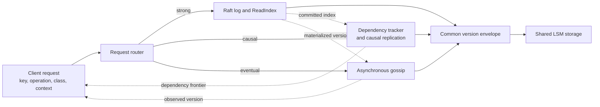

# Mixing Replication Mechanisms Under a Shared Keyspace: An Evaluation of Per-Request Consistency Selection in Meridian

**Nicholas Emmanuel**<br>
nicholasemmanuel321@gmail.com

**Status.** This document is a pre-measurement research protocol and implementation-readiness report, updated September 11, 2026. It is not a completed experimental paper. The audit in §5.1–§5.3 describes baseline commit [`7db514c40c07fce68aa0794551830fd51a9224fd`](https://github.com/nickemma/Meridian/commit/7db514c40c07fce68aa0794551830fd51a9224fd); the working tree has since added the client API and the three data paths. A repeatable local leader-stop/restart integration test now validates basic strong-path recovery, but it is not a retained fault trial. No Meridian latency, throughput, staleness, availability, or recovery *measurement* result is claimed below.

## 1. Abstract

Geo-replicated stores commonly select a consistency model for a deployment or vary replica and quorum choices within one replication design. Meridian proposes a different composition: Raft consensus, causal dependency tracking, and asynchronous gossip would coexist behind one key-value API, with a consistency class supplied on each request. This report asks whether that composition can outperform a fixed mechanism when each operation must still receive its required semantics, what optionality costs, and how the trade changes during failures. An audit of the September 10, 2026 implementation finds that the proposed experiment is not yet runnable. The repository contains an in-memory Raft protocol core and a standalone Rust log-structured merge storage engine, but no client key-value service, causal path, gossip path, shared version representation, storage bridge, YCSB adapter, or staleness instrumentation. Seventy-nine Go tests passed under the race detector and 22 Rust tests passed, establishing component-level test health rather than distributed correctness or performance. This report therefore contributes no benchmark result. It fixes the cross-mechanism contract, hypotheses, baselines, metrics, workloads, and acceptance gates before measurement so later results can be reported without retrofitting the design to them.

## 2. Introduction

Geo-replication creates a direct tension between coordination and latency. A linearizable operation must appear to take effect at one instant between invocation and response, while weaker models allow replicas to answer with less coordination.[^1] Applications seldom place the same requirement on every operation. An inventory reservation may require one global order, a cart update may require only that a user observes their own causal history, and an impression counter may tolerate temporary divergence.

Selecting consistency per operation is established prior work. Pileus lets applications express latency and consistency priorities and chooses servers to satisfy those service-level agreements.[^2] RedBlue consistency separates operations that require a common order from operations that may execute with weaker coordination.[^3] Consistency Rationing changes consistency treatment according to the cost of inconsistency,[^4] and Correctables return increasingly consistent answers during one logical operation.[^5] Per-request choice by itself is therefore not a contribution.

The narrower question is whether three structurally different replication mechanisms can safely and profitably share one logical namespace and one storage layer. Dynamo-style systems vary read and write quorums while retaining a common versioning and anti-entropy substrate.[^6] Pileus changes replica selection over one propagation design. In the proposed Meridian design, a strong request enters a Raft log, a causal request carries and checks dependencies, and an eventual request uses asynchronous dissemination. This composition raises questions that do not arise when only a quorum parameter changes: how versions from different paths are compared, what a weaker read of a strongly written key promises, and whether a weak write may race a strong write.

This study asks:

- **Q1.** For a workload containing operations with different semantic requirements, does per-request mechanism selection outperform the best fixed mechanism that satisfies every operation's requirement? Where does it fail to do so?
- **Q2.** What CPU, memory, storage, network, and tail-latency cost does support for all three mechanisms impose when a deployment uses only one?
- **Q3.** How do the performance and availability differences change during a regional partition, a Raft leader failure, and a slow-replica failure?

The intended contributions are a precise contract for composing the mechanisms, a reproducible evaluation against fixed-mode and external baselines, and a measured account of the cases where the additional machinery does not pay. The audited commit was a foundation for that work, not yet an implementation of it. The September 11 implementation update below records what changed after that audit without converting functional tests into performance claims.

## 3. Background and Motivation

### 3.1 Consistency contracts

Linearizability preserves real-time order: once an operation completes, a later operation must observe a state consistent with the first operation having taken effect.[^1] Raft supplies an ordered replicated log, but a key-value service still needs durable Raft state, a deterministic state machine, and a correct linearizable-read procedure; log replication alone does not make its client API linearizable.[^10]

Causal consistency requires all observers to preserve the order of causally related operations while permitting different orders for concurrent operations. COPS tracks dependencies and delays visibility until dependencies are present,[^7] while Eiger extends causal operation to a richer data model and transactions.[^8] A causal contract therefore needs a client context, a dependency representation, and an exposure rule. A vector-clock type without those three pieces is insufficient.

Eventual consistency promises convergence after updates and communication failures cease. It does not impose a finite staleness bound by itself. Dynamo combines object versioning, reconciliation, and replica synchronization to remain available under failures,[^6] while Probabilistically Bounded Staleness shows how observed staleness can be quantified in versions and wall-clock time rather than described only as “eventual.”[^12]

During a partition, a system cannot guarantee both atomic consistency and a response from every non-failing node under the standard asynchronous model.[^9] Meridian's experiment must therefore report operation outcomes and availability separately for each class. A successful eventual read during a partition and a failed strong write are different contract outcomes, not one aggregate error rate.

### 3.2 Wide-area latency floor

A leader-based strong write requires communication with a quorum before acknowledgement. If the quorum crosses regions, its latency includes at least a cross-region message round trip plus processing and durable-write costs. Local causal and eventual operations can avoid that round trip only by accepting their weaker contracts. The actual floor depends on placement; this study will not insert remembered Internet-latency numbers. The experiment must first measure at least 10,000 idle TCP or ICMP round trips for every directed region pair, publish the raw samples, and derive the `tc netem` parameters from those measurements.

Emulation must preserve topology rather than applying one delay to every link. Each directed pair will receive its measured median delay and jitter distribution. The paper will report both the source measurements and the exact commands, and will label all resulting observations as emulated wide-area results.

### 3.3 Motivating workload

The motivating application is an online storefront with three defensible semantic classes. Inventory reservation and release require strong compare-and-set behavior to avoid overselling. Cart and profile operations require causal session behavior so that a user observes their own earlier updates. Page-view events and recommendation materializations permit temporary divergence and deterministic convergence.

The primary mixed workload is fixed before measurement at 20% strong operations, 40% causal operations, and 40% eventual operations:

| Share | Operation | Class | Reason |
|---:|---|---|---|
| 10% | Inventory reservation or release | Strong | Concurrent reservations must have one order. |
| 10% | Inventory read | Strong | A completed reservation must be reflected in a later read. |
| 15% | Cart or profile update | Causal | Later actions depend on the user's earlier reads and writes. |
| 25% | Cart or profile read | Causal | Session dependencies must be visible. |
| 20% | Append a uniquely keyed page-view or impression event | Eventual | Temporary propagation delay is acceptable. |
| 20% | Read recommendation materialization | Eventual | A stale answer is useful if its version is exposed. |

This is an illustrative workload, not a claim about the average production storefront. To prevent one favorable mixture from carrying the result, the evaluation will also sweep the strong-operation share through 0%, 25%, 50%, 75%, and 100%, divide the remainder equally between causal and eventual operations, and report every point. A second sweep will vary the Zipfian request parameter and the fraction of hot keys. Any conclusion about representativeness must be limited to the measured mixes.

## 4. Design Under Test

This section fixes the target design before benchmarks. It does not describe the audited executable. Section 5 states what is presently implemented.

### 4.1 Architecture



Every request contains a key, operation, requested class, and client context. The router validates the request against immutable key metadata and sends it to one replication path. All paths materialize a common version envelope in one storage engine, but they do not impose one common ordering protocol.

### 4.2 Replication paths

**Strong.** Writes are acknowledged only after their log entry is committed by a Raft majority and applied to the local state machine. Reads use Raft's ReadIndex procedure or an equivalently justified read barrier and wait until the returned commit index is applied. The client receives the applied Raft index. Loss of a majority makes new strong operations unavailable. The implementation must persist current term, vote, and log before the corresponding responses.

**Causal.** A client sends a dependency context containing a vector frontier and any Raft commit index on which the operation depends. A replica exposes a version only after its local frontier dominates the version's dependencies and its applied Raft index reaches the supplied dependency. Local writes advance the origin component and are acknowledged without a cross-region round trip. A missing dependency may delay or fail the request according to an explicit timeout; it must not be silently ignored.

**Eventual.** A local replica acknowledges after a durable local write and disseminates the version asynchronously. The stored object retains a version vector. Dominated versions are discarded; concurrent versions are resolved by a deterministic rule fixed before testing. The proposed v1 rule is a multi-value register: all maximal concurrent siblings remain visible until a client supplies a resolving write. This avoids using unsynchronized wall clocks as a hidden last-writer-wins oracle. Eventual reads return the observed version set and make no finite freshness promise.

### 4.3 Shared storage and version representation

The LSM engine stores an envelope rather than an untyped byte value:

```text
namespace policy = {key_prefix, write_class, creation_epoch}
version      = {value_or_tombstone, class, origin, vector,
                raft_index, dependencies, accepted_at}
```

Fields that do not apply to one class are empty. `accepted_at` supports measurement and never resolves conflicts. A longest-prefix namespace policy assigns the write class before data-path operations begin; policy entries are established through Raft and are immutable in v1. This permits new eventual keys under a predeclared prefix without coordinating each creation. A request with no locally known policy is rejected. Compaction may remove a version only when the protocol-specific garbage-collection rule proves that no live replica or client context can still require it. The evaluation must measure write amplification and the bytes consumed by the envelope separately from user bytes.

### 4.4 Cross-mechanism semantics

The consistency classes form the order `strong > causal > eventual`. A request may read a key at its namespace's write class or at a weaker class. A write must use the immutable class assigned by the longest matching namespace policy. A read requesting a stronger class than the key supports, or a write requesting a different class, returns `FAILED_PRECONDITION` before mutation. Online reclassification is outside v1 because a safe transition requires a barrier that drains or incorporates writes from the previous protocol.

The three required cases have the following behavior:

1. **A key written through Raft and read through gossip.** Once committed, the Raft-applied envelope is queued for asynchronous dissemination. The eventual reader may observe an older version, including absence if it has not yet received any version. The response includes the observed version and the fact that the eventual class was served. The promise is eventual convergence after communication resumes; the earlier strong write does not upgrade this read.
2. **A causal read depending on a Raft commit.** The client context carries the dependency's Raft index. The causal replica waits until its local applied Raft index is at least that value before exposing the result. It then evaluates ordinary vector dependencies. Timeout returns an explicit dependency-unavailable error. The dependency is never silently skipped.
3. **Concurrent strong and eventual writes to one key.** They are forbidden. The immutable namespace policy admits exactly one request and rejects the other with `FAILED_PRECONDITION`. This is a resolution rule by admission control rather than last-writer-wins. A partitioned replica may accept eventual writes, including new keys, only under a previously installed eventual namespace policy; it may not create or reclassify policies without reaching the metadata quorum.

The central invariant is:

> For every key, all accepted writes are ordered or reconciled by exactly one replication mechanism; a read never claims a guarantee stronger than that mechanism, and a causal response is exposed only after all dependencies named by its client context are locally visible.

An informal argument has three parts. Immutable, quorum-created namespace policies prevent two write mechanisms from accepting writes for the same key, so Raft ordering cannot race a bypass write. A strong read waits for an applied read barrier, placing it after earlier completed strong writes. A causal replica checks both the vector frontier and the Raft-index component before exposure, which closes the dependency set across protocols. Eventual replicas retain maximal concurrent versions and apply deterministic dominance rules, so replicas that receive the same updates converge. These arguments depend on correct implementations of Raft persistence, dependency transport, anti-entropy, and policy admission; they are design obligations, not evidence that the current code satisfies the invariant.

This restriction narrows the contribution. Meridian v1 mixes replication mechanisms across one namespace and permits weaker reads of stronger keys, but it does not permit arbitrary per-request write semantics for one key. The evaluation must use that exact claim.

## 5. Implementation Audit

### 5.1 Audited code

At commit `7db514c40c07fce68aa0794551830fd51a9224fd`, the repository contains 1,464 non-test lines of Go in [`internal/raft/`](../internal/raft/), 1,122 lines of Rust in [`storage-engine/src/`](../storage-engine/src/), and 935 lines of project Python in [`chaos/`](../chaos/) when generated clients and the virtual environment are excluded. Generated protobuf code, tests, the secrets layer, policy code, anomaly detection, audit code, and metrics are outside those counts.

Raft is implemented from scratch. The defensible reason is experimental control: mechanism-level instrumentation, deterministic fault hooks, and the ability to modify admission and version propagation across paths. Educational value is secondary. This choice also creates a larger correctness burden than using a mature library, so every result must be interpreted alongside model checking, history checking, and external-baseline performance.

### 5.2 What exists and what is missing

| Capability needed by the study | Evidence at the audited commit | Status and consequence |
|---|---|---|
| Client key-value API | [`proto/raft/raft.proto`](../proto/raft/raft.proto) defines only peer Raft RPCs; [`internal/server/server.go`](../internal/server/server.go) registers only that service. | **Missing.** YCSB and application clients cannot issue reads or writes. |
| Strong write API | [`Node.Submit`](../internal/raft/node.go) is an in-process method and returns after appending locally, before commit. | **Incomplete.** It is not a client-visible committed-write contract. |
| Linearizable reads | No read RPC, ReadIndex implementation, lease proof, or state-machine read exists. | **Missing.** The “all strong” baseline cannot be run. |
| Durable Raft | Term, vote, and log live in Go memory. | **Missing.** A restarted node loses consensus state. |
| Applied key-value state | [`applyCommitted`](../internal/raft/commit.go) logs command bytes and advances `lastApplied`. | **Missing.** Committed entries do not update a database. |
| Rust storage bridge | The Rust crate is not referenced by Go and exports no FFI or service boundary. | **Missing.** The Raft and LSM components are separate programs. |
| Causal replication | No vector clock, dependency context, causal RPC, or exposure rule exists outside documentation. | **Missing.** No causal configuration can be measured. |
| Eventual replication | No gossip, anti-entropy, sibling reconciliation, or eventual client response exists. | **Missing.** No eventual configuration can be measured. |
| Cross-mechanism metadata | No namespace-policy registry or common version envelope exists. | **Missing.** Section 4.4 is not enforced. |
| Request metrics | Prometheus collectors exist, but the absent client and storage paths cannot update end-to-end latency, staleness, or availability metrics. | **Incomplete.** Existing metrics cannot answer Q1–Q3. |
| Benchmark harness | No YCSB binding, offered-load driver, raw result schema, trial runner, or `netem` script is tracked. | **Missing.** There is no reproducible evaluation path. |
| External baselines | No etcd or Cassandra service, schema, or binding is tracked. | **Missing.** Absolute performance cannot be interpreted. |
| Failure validation | The Python scenarios test that containers remain in the `running` state; they do not issue client operations or measure recovery curves. | **Insufficient.** They show process liveness, not service availability or safety. |
| Linearizability checking | [`chaos/verifier.py`](../chaos/verifier.py) is not called by the scenarios and fixes writes in completion-time order rather than searching legal histories. | **Insufficient.** It is neither integrated nor a sound general linearizability checker. |

The storage audit also found a concrete recovery defect. WAL deserialization maps a tombstone record to an empty byte vector, and recovery unconditionally calls `memtable.put`; therefore a delete becomes an empty value after reopen. Existing tests cover in-process tombstones and put recovery but not delete recovery. The WAL grows without truncation after SSTable flushes, which is a separate measurement and operability concern.

### 5.3 Current reproducible evidence

The following commands were run on September 10, 2026 at the audited commit:

```text
go test ./... -race -count=1
cargo test --manifest-path storage-engine/Cargo.toml
```

All Go packages passed under the race detector. The source contains 79 Go tests, of which 30 are in `internal/raft`; no Go benchmarks or fuzz targets are present. The Rust run reported 22 passed, 0 failed, 0 ignored, and 0 measured. The environment was Go 1.26.6, Rust 1.94.1, Linux 6.18.33.2 under WSL2, 16 logical CPUs, and 7,773,860 kB reported memory. No Docker cluster was running.

These are build-and-unit-test results. They do not answer any research question, test networked client behavior, establish linearizability, or supply a number suitable for the final abstract.

### 5.4 Verification required before measurement

Before performance testing, the implementation must pass four correctness gates:

1. A state-machine or model-based Raft test covering elections, log repair, crash/restart persistence, and membership assumptions.
2. A Porcupine-style or Jepsen-compatible checker over real client histories, with nemesis events and clock-independent invocation/response intervals.
3. Property tests for vector dominance, dependency closure, sibling reconciliation, and convergence under reordered, duplicated, and delayed messages.
4. Cross-mechanism tests for every case in Section 4.4, including stale metadata, rejected mixed writes, a Raft dependency arriving after a causal request, and healing after a partition.

Performance data collected before these gates pass may diagnose the harness, but it cannot support the paper's claims.

### 5.5 September 11 implementation update

The current working tree adds a client `KVService` with `Get`, `Put`, `Delete`, compare-and-set, and status RPCs; a Rust-backed deterministic Raft state machine; durable Raft state; and a three-node integration test that exercises one strong, causal, and eventual operation. Strong reads use a committed no-op barrier rather than ReadIndex, so their extra log entry is a known evaluation cost. Causal replicas use vector-clock and applied-Raft-index checks, queue reordered records, persist a complete replica snapshot in the Rust engine, and exchange records over a peer gRPC service. Eventual replicas use a multi-value register, persist their snapshot in the same engine, send an immediate asynchronous gossip batch, and retransmit maximal records every 250 ms. Client responses expose concurrent siblings through `GetResponse.versions`.

Namespace policies are configured at startup as immutable longest-prefix entries. A write includes the policy revision in its context and fails on mismatch; the integration test uses `/strong/`, `/causal/`, and `/eventual/` namespaces. This enforces one write path per key. Policies are **not** yet Raft-installed. After a strong put or delete applies to local storage, the state-machine wrapper materializes a record carrying that Raft index into both weak registers. A causal reader checks its local applied index before exposure; an eventual reader receives the result with `served_consistency=EVENTUAL`. The integration test verifies both reads after a strong write.

This bridge is not yet an independently delayed dissemination queue: every Raft replica materializes the strong record as it applies the Raft log. It therefore supports the visibility contract needed by the current test, but it cannot measure the proposed acknowledgement-to-eventual-visibility delay separately from Raft replication. Policy reconfiguration, durable weak-path outboxes, and a separately scheduled materialization stream remain open.

The repository now includes `cmd/meridian-load`, which writes an operation-level JSONL history and a percentile summary, `cmd/meridian-check`, `bench/workloads/mixed.json`, and `scripts/netem.sh`. The checker exhaustively searches legal linearizations for a bounded, single-register strong history; it is useful for fault smoke runs but is not a Porcupine-scale checker. The current driver is closed-loop and supports only simple get/put mixes. It is useful for development smoke runs, but it is not the pre-registered open-loop, YCSB-compatible harness and cannot answer Q1–Q3 alone. No external baseline, staleness oracle, fault timeline, independent large-history checker, durable gossip outbox, or retained result exists.

The live three-node test now identifies the elected leader, stops it, waits for a replacement leader, writes a new strong key through the surviving quorum, restarts the former leader, and verifies that its durable state machine catches up with both the pre-failure and post-failure acknowledged keys. It passed five consecutive local race-detector runs on September 11. While building that test, it exposed three defects: overlapping replication rounds could transiently separate a follower's commit index from its log; concurrent vote handlers could grant two votes in one term; and a heartbeat could acknowledge an unrelated follower suffix. The implementation now merges replicated suffixes atomically, serializes state-changing Raft RPCs, and reports only the prefix confirmed by an `AppendEntries` request. Regression tests cover each case. This is functional regression evidence, not a latency, availability, or linearizability result.

### 5.6 Feasibility and scope control

The full study remains achievable as a new implementation and evaluation effort; it is not achievable by running benchmarks against the audited code alone. The current working tree removes the client-service, causal-path, gossip-path, and durable-state-machine blockers, but the correctness harness and evaluation pipeline remain on the critical path.

Three dated decisions keep the work honest. By September 27, gates G1 and G2 in Appendix A must close. By October 15, gates G3 through G6 must close and the semantics in Section 4.4 must remain unchanged unless a dated amendment explains why. By October 31, the harness and both external baselines must complete a full smoke run. Missing the October 15 decision point means the three-mechanism paper cannot usefully proceed under this title; cutting Q2 does not compensate for a missing causal or eventual system. Missing only the Q2 instrumentation after the core gates close triggers the planned cut of the optionality section.

## 6. Evaluation Protocol

### 6.1 Questions, hypotheses, and decision rules

**Pre-specified September 10, 2026, before performance measurement.** The per-request configuration is expected to outperform the all-strong configuration on maximum sustainable goodput and matched-load tail latency as the fraction of causal and eventual operations increases, because fewer requests require a wide-area quorum. It is not expected to beat all-eventual on raw latency or throughput. All-eventual and all-causal are ineligible answers to Q1 when they fail the workload's strong-operation requirements; they remain useful lower-cost reference points. The benefit is expected to grow during loss of the Raft leader or a minority-region partition because causal and eventual keys can continue locally, while it may disappear when strong operations dominate, hot keys concentrate work on Raft, metadata pressure causes compaction, or a slow replica creates queues shared by all paths.

Q1's primary metric is maximum sustainable goodput: completed operations per second at which achieved throughput is at least 95% of offered load, the error rate for operations expected to be available is below 1%, and no checked semantic invariant fails. The primary latency is per-class p99 at matched offered load. p50, p95, p99.9, and saturation curves are secondary results. A per-request configuration “pays” only if its median maximum sustainable goodput exceeds every semantically eligible fixed-mode configuration across five paired trials and its per-class guarantees pass. Raw performance against ineligible weak modes will be shown but will not be described as a win.

Q2 reports the difference between a full build and compile-time single-mechanism builds in idle resident memory, memory per populated key, CPU per completed operation, bytes sent per operation, storage bytes per user byte, compaction write amplification, and p99 latency. Q3 reports one-second time series of offered load, completed goodput, errors by type, and p99 latency, plus Raft election duration, dependency backlog, gossip convergence time, and stale-read distributions.

Every configuration uses at least five trials with paired workload seeds. The paper reports the median and interquartile range across trials and retains every raw trial. It does not substitute means for latency percentiles. Warm-up, steady-state measurement, and cool-down intervals are fixed in the harness configuration before the first retained run.

### 6.2 Setup record

The final paper must replace every `UNSET` below with machine-readable metadata emitted by the harness. No rounded or inferred value is acceptable.

| Item | Required record | Current value |
|---|---|---|
| Server hardware | Provider, instance type, vCPU model/count, memory bytes, disk type, provisioned IOPS/throughput | UNSET |
| Client hardware | Same fields, plus client count | UNSET |
| Topology | Nodes, regions, placement, replication factor per mechanism | UNSET |
| Network | Real or emulated; pairwise RTT samples; delay, jitter distribution, loss, reorder, and queue parameters | UNSET |
| Software | OS image, kernel, Go, Rust, Java, YCSB, etcd, Cassandra, Docker, and Meridian commit | UNSET |
| Dataset | Key count, key length, value-size distribution, total bytes, and measured cache residency | UNSET |
| Load generation | Client processes, threads, target rates, timeout, retry policy, open/closed-loop behavior | UNSET |
| Trial protocol | Warm-up, measurement, cool-down, trials, seeds, and run order randomization | UNSET |

The local WSL2 environment from Section 5.3 is unsuitable for final absolute results because it is neither isolated nor a multi-region deployment. It remains useful for functional development.

### 6.3 Baselines

| Configuration | What it isolates | Eligibility for the mixed workload |
|---|---|---|
| Meridian, all strong | Cost of satisfying every operation through consensus | Eligible |
| Meridian, all causal | One internal mechanism without Raft on the data path | Ineligible for strong operations |
| Meridian, all eventual | Internal latency floor and staleness reference | Ineligible for strong and causal operations |
| Meridian, per request | Proposed configuration | Eligible if all per-class checks pass |
| etcd, pinned version | Independent mature Raft key-value reference | Eligible when all operations use strong semantics |
| Cassandra, `QUORUM` | External quorum-tuned reference | Reported with its actual contract; not labeled linearizable without LWT/serial conditions |
| Cassandra, `ONE` | External weak-consistency latency and availability reference | Ineligible for strong and causal operations |

Versions are deliberately not selected in this document. They must be pinned together when the harness is frozen, then left unchanged for all retained trials. Meridian's from-scratch Raft is interpreted against etcd rather than assumed efficient.

### 6.4 Workloads

YCSB supplies a standard and extensible framework for comparing serving stores.[^13] Workloads A, B, C, D, and F will run against every compatible configuration with the standard operation proportions and one published property file per run. Workload F requires an atomic read-modify-write implementation; a client-side read followed by an unrelated write is not equivalent. Unsupported operations will cause a configuration to be omitted with a reason rather than silently remapped.

The storefront workload from Section 3.3 is the primary mixed-class test. It uses disjoint key families whose immutable namespace policies are installed before warm-up. It also includes a correctness stream that creates dependencies across keys: a committed inventory update is placed in client context before a causal cart read, and the checker verifies that the dependency is locally visible before the causal response. Workload seeds, generated keys, request classes, and dependency edges are written to the raw history.

To avoid coordinated omission, the primary driver schedules operations from an open-loop target-rate process and records scheduled time, invocation time, and response time. Standard YCSB closed-loop results are reported separately where required for comparability. Retries are disabled in latency measurements; retryable failures are recorded as outcomes, and a separate experiment may measure an explicit client retry policy.

### 6.5 Q1: Does selection pay?

No Q1 result exists at the audited commit. The final analysis will present latency against offered load, throughput against offered load, and the following table at the maximum sustainable point. Each cell will contain the median across five trials with its interquartile range in the appendix.

| Configuration | p50 | p95 | p99 | p99.9 | Goodput | Result status |
|---|---:|---:|---:|---:|---:|---|
| All strong | Not run | Not run | Not run | Not run | Not run | Implementation gate open |
| All causal | Not run | Not run | Not run | Not run | Not run | Implementation gate open |
| All eventual | Not run | Not run | Not run | Not run | Not run | Implementation gate open |
| Per request | Not run | Not run | Not run | Not run | Not run | Implementation gate open |
| etcd | Not run | Not run | Not run | Not run | Not run | Harness gate open |
| Cassandra `QUORUM` | Not run | Not run | Not run | Not run | Not run | Harness gate open |
| Cassandra `ONE` | Not run | Not run | Not run | Not run | Not run | Harness gate open |

The interpretation must state separately whether selection beats all-strong, whether it beats any semantically eligible fixed mode, and how far it remains behind the raw all-eventual floor. “Better than the average baseline” is not a success criterion.

### 6.6 Staleness

Every accepted version receives a logical identifier and an acceptance event in an append-only measurement log. For Raft, acceptance is commit-and-apply, not leader append. Each read records the returned version set and client dependencies. An offline oracle reconstructs the latest non-concurrent version completed before the read's invocation.

The study reports two staleness measures per class: version staleness, the number of completed versions omitted by a read, and time staleness, the interval between the acceptance time of the newest eligible version and that of the returned version. It also reports acknowledgement-to-visibility delay at the first, majority, and final replica. Concurrent writes are labeled separately rather than assigned an arbitrary total-time order. This follows the PBS emphasis on quantifying both version and wall-clock staleness.[^12]

Strong reads must have zero eligible-version staleness or the run fails correctness. Causal reads must include all dependencies even if they omit concurrent or causally unrelated versions. Eventual reads have no finite bound; the observed distribution, maximum, and convergence after healing are the result.

### 6.7 Q2: Cost of optionality

The build system will produce `strong-only`, `causal-only`, `eventual-only`, and `full` binaries from the same commit. Each single-mode build removes unused routers, metadata handlers, replication workers, and metrics at compile time. Measuring a full binary configured to one mode answers a different question from measuring code that contains only one mechanism, so both are required.

Vector metadata will be measured while varying replica count through 3, 5, 7, and 9 and while varying concurrent writer count. The result must report allocated and serialized bytes rather than a theoretical component count alone. If time requires cutting one empirical section, Q2 may be shortened, but the full build's memory and storage overhead must still appear as a limitation.

### 6.8 Q3: Failures

Each failure trial has a steady pre-failure interval, an injection marker, a fixed fault interval, a heal or restart marker, and a recovery interval. The harness, not a person watching logs, identifies the leader and target. Timelines use one-second bins and retain unsuccessful requests.

1. **Regional partition.** Isolate one region in both directions. Report per-class goodput, errors, latency, dependency backlog, and the staleness and convergence curve after healing.
2. **Leader failure.** Terminate the identified Raft leader during steady offered load. Report last successful strong request, election completion, first successful post-election strong request, ambiguous outcomes, and the contemporaneous causal and eventual curves.
3. **Gray failure.** Add delay, jitter, packet loss, and a bounded queue to one replica without killing it. Report queue growth and tail latency. Repeat with the slow node as leader and follower.

The current chaos suite cannot produce these figures because it checks container status only. A passing process-liveness scenario is not counted as a successful service-failure trial.

### 6.9 Threats to validity

Even after implementation, the planned evidence will have narrow external validity. One operator will construct and run the harness. The wide-area network will probably be emulated, a small cluster cannot reproduce contention or correlated failures at production scale, and the application mix is author-selected. A single shared physical host can hide or create resource interference. Five trials reveal large variance but do not make small differences trustworthy.

Internal validity depends on the correctness of three new replication paths and the measurement oracle. Clock-based staleness on one emulation host is easier than clock-based staleness across real regions and must not be generalized without a clock-error bound. Client timeouts and retries can turn unavailability into misleading latency improvements. External systems have different data models and tuning surfaces, so etcd and Cassandra results are reference points rather than proof that the systems are functionally identical.

The largest construct-validity risk is the immutable namespace write class. It makes the cross-mechanism invariant tractable but means Meridian does not support arbitrary mixed-mode writes to one key. Results must be framed as per-request routing within a shared namespace under that restriction.

## 7. Related Work

### 7.1 Tunable and per-operation consistency

Pileus is the closest conceptual neighbor. It accepts an ordered consistency/latency SLA and selects a read strategy using observed conditions.[^2] Meridian's proposed router instead selects among different replication paths whose versions must coexist in one storage representation. Pileus therefore establishes the value of dynamic selection, while Meridian's open question is the engineering and semantic cost of mechanism composition. A Meridian paper must not claim per-operation consistency choice as novel.

RedBlue consistency classifies operations according to whether they require a common order and develops conditions under which weak operations preserve application invariants.[^3] It is closer to application-semantic partitioning than to three interchangeable storage mechanisms. Meridian borrows the discipline of rejecting operations that cannot safely use the weak path, but evaluates co-resident Raft, causal, and gossip machinery.

Consistency Rationing divides data according to the penalty of inconsistency and can adjust treatment at runtime.[^4] Meridian v1's immutable write class is less adaptive. Correctables expose preliminary and final answers with increasing guarantees during one operation,[^5] whereas Meridian returns one answer at the requested admissible class. These distinctions make the project comparative rather than categorically new.

### 7.2 Eventual and causal geo-replication

Dynamo demonstrates a highly available key-value design using versioning, reconciliation, and replica synchronization.[^6] COPS makes cross-key causal dependencies explicit and checks them before exposure,[^7] and Eiger extends low-latency causal operation to richer transactions and a column-family model.[^8] These systems establish the mechanisms Meridian proposes to combine. The remaining question is whether their metadata, queues, and failure behavior interfere when implemented behind one router and storage layer.

### 7.3 Strongly consistent systems

Raft defines the replicated-log algorithm used by Meridian's strong path.[^10] Spanner demonstrates synchronous wide-area replication and external consistency at a scale and with a time service far beyond this artifact.[^11] Meridian does not advance consensus. Its strong-path result is credible only if the implementation is checked for safety and compared with an independent implementation.

### 7.4 Measurement and benchmarking

PBS provides a vocabulary and methods for measuring staleness in versions and time.[^12] YCSB provides standard serving workloads and an extensible client framework.[^13] Neither answers the mixed-mechanism question by itself. Meridian's evaluation must add dependency-aware histories, class-specific correctness checking, open-loop load, and failure timelines.

Prior work establishes that applications can choose or benefit from more than one consistency level. It leaves a narrower systems question: under an enforced cross-path contract, what benefit and interference result when consensus, causal dependency tracking, and asynchronous gossip share one keyspace and storage engine? This study is designed to answer that question, but the audited implementation cannot yet do so.

## 8. Limitations

The present artifact has working strong, causal, and eventual client paths, but it still supplies no evidence for Q1–Q3. A live integration test and passing unit tests do not substitute for retained workload trials, fault timelines, or an independent history checker.

The target cross-mechanism invariant has only an informal argument. Key classes are immutable, and stronger reads of weaker keys are rejected. Those choices avoid an unresolved mixed-write ordering problem but reduce flexibility and may make the contribution resemble data-category routing more than unconstrained per-request consistency.

The Raft code has not been model checked, and its bounded history checker is inadequate for general linearizability. It persists a complete hard-state/log file rather than using snapshots or a segmented log. The LSM engine is connected to the server through a C ABI and has tombstone-recovery coverage, but it has not received interruption stress testing. No Byzantine faults are considered.

The proposed evaluation uses an author-selected workload, a limited replica count, and likely emulated wide-area conditions. External baselines differ in semantics and maturity. The project is single-operator work, increasing the chance of configuration and measurement mistakes.

## 9. Conclusion

The proposed research question is viable, but a completed experimental paper cannot be produced from the current build. At the audited commit, Meridian has separately tested Raft and LSM components, not three replication mechanisms over a shared keyspace. The honest current result is an implementation-readiness failure: every measurement required for Q1–Q3 remains blocked by missing client, storage, replication, semantics-enforcement, and harness code.

The path to a defensible paper is now fixed. Each namespace has one immutable write mechanism, reads may request only that guarantee or a weaker one, Raft dependencies participate in causal contexts, and conflicting write classes are rejected. The hypotheses, eligibility rule for baselines, workloads, metrics, and failure scenarios are recorded in this dated document before measurement. If the implementation satisfies the correctness gates and the harness emits the required raw evidence, the final paper can replace this readiness conclusion with measured answers. If it does not, the negative outcome must remain visible.

## 10. References

[^1]: Maurice P. Herlihy and Jeannette M. Wing. “[Linearizability: A Correctness Condition for Concurrent Objects](https://doi.org/10.1145/78969.78972).” *ACM Transactions on Programming Languages and Systems* 12, no. 3 (1990): 463–492.

[^2]: Douglas B. Terry, Vijayan Prabhakaran, Ramakrishna Kotla, Mahesh Balakrishnan, Marcos K. Aguilera, and Hussam Abu-Libdeh. “[Consistency-Based Service Level Agreements for Cloud Storage](https://www.microsoft.com/en-us/research/publication/consistency-based-service-level-agreements-for-cloud-storage-2/).” In *Proceedings of the 24th ACM Symposium on Operating Systems Principles (SOSP '13)*, 309–324, 2013. DOI: [10.1145/2517349.2522731](https://doi.org/10.1145/2517349.2522731).

[^3]: Cheng Li, Daniel Porto, Allen Clement, Johannes Gehrke, Nuno Preguiça, and Rodrigo Rodrigues. “[Making Geo-Replicated Systems Fast as Possible, Consistent when Necessary](https://www.usenix.org/conference/osdi12/technical-sessions/presentation/li).” In *10th USENIX Symposium on Operating Systems Design and Implementation (OSDI '12)*, 265–278, 2012.

[^4]: Tim Kraska, Martin Hentschel, Gustavo Alonso, and Donald Kossmann. “[Consistency Rationing in the Cloud: Pay Only When It Matters](https://www.vldb.org/pvldb/vol2/vldb09-759.pdf).” *Proceedings of the VLDB Endowment* 2, no. 1 (2009): 253–264. DOI: [10.14778/1687627.1687657](https://doi.org/10.14778/1687627.1687657).

[^5]: Rachid Guerraoui, Matej Pavlovic, and Dragos-Adrian Seredinschi. “[Incremental Consistency Guarantees for Replicated Objects](https://www.usenix.org/conference/osdi16/technical-sessions/presentation/guerraoui).” In *12th USENIX Symposium on Operating Systems Design and Implementation (OSDI '16)*, 169–184, 2016.

[^6]: Giuseppe DeCandia, Deniz Hastorun, Madan Jampani, Gunavardhan Kakulapati, Avinash Lakshman, Alex Pilchin, Swaminathan Sivasubramanian, Peter Vosshall, and Werner Vogels. “[Dynamo: Amazon's Highly Available Key-Value Store](https://www.amazon.science/publications/dynamo-amazons-highly-available-key-value-store).” In *Proceedings of the 21st ACM Symposium on Operating Systems Principles (SOSP '07)*, 205–220, 2007. DOI: [10.1145/1294261.1294281](https://doi.org/10.1145/1294261.1294281).

[^7]: Wyatt Lloyd, Michael J. Freedman, Michael Kaminsky, and David G. Andersen. “[Don't Settle for Eventual: Scalable Causal Consistency for Wide-Area Storage with COPS](https://doi.org/10.1145/2043556.2043593).” In *Proceedings of the 23rd ACM Symposium on Operating Systems Principles (SOSP '11)*, 401–416, 2011.

[^8]: Wyatt Lloyd, Michael J. Freedman, Michael Kaminsky, and David G. Andersen. “[Stronger Semantics for Low-Latency Geo-Replicated Storage](https://www.usenix.org/conference/nsdi13/technical-sessions/presentation/lloyd).” In *10th USENIX Symposium on Networked Systems Design and Implementation (NSDI '13)*, 313–328, 2013.

[^9]: Seth Gilbert and Nancy Lynch. “[Brewer's Conjecture and the Feasibility of Consistent, Available, Partition-Tolerant Web Services](https://doi.org/10.1145/564585.564601).” *ACM SIGACT News* 33, no. 2 (2002): 51–59.

[^10]: Diego Ongaro and John Ousterhout. “[In Search of an Understandable Consensus Algorithm](https://www.usenix.org/conference/atc14/technical-sessions/presentation/ongaro).” In *2014 USENIX Annual Technical Conference (USENIX ATC '14)*, 305–320, 2014.

[^11]: James C. Corbett et al. “[Spanner: Google's Globally-Distributed Database](https://research.google/pubs/spanner-googles-globally-distributed-database-2/).” In *10th USENIX Symposium on Operating Systems Design and Implementation (OSDI '12)*, 251–264, 2012.

[^12]: Peter Bailis, Shivaram Venkataraman, Michael J. Franklin, Joseph M. Hellerstein, and Ion Stoica. “[Probabilistically Bounded Staleness for Practical Partial Quorums](https://www.vldb.org/pvldb/vol5/p776_peterbailis_vldb2012.pdf).” *Proceedings of the VLDB Endowment* 5, no. 8 (2012): 776–787.

[^13]: Brian F. Cooper, Adam Silberstein, Erwin Tam, Raghu Ramakrishnan, and Russell Sears. “[Benchmarking Cloud Serving Systems with YCSB](https://doi.org/10.1145/1807128.1807152).” In *Proceedings of the 1st ACM Symposium on Cloud Computing (SoCC '10)*, 143–154, 2010.

Bibliographic metadata above was checked against publisher, author, or official proceedings pages on September 10, 2026. Personal reading and defensibility remain an authorship requirement; each reference should stay in a submitted version only after the author can explain how it bears on Meridian.

## 11. Artifact Availability

The source repository is [github.com/nickemma/Meridian](https://github.com/nickemma/Meridian). The audited code is commit [`7db514c40c07fce68aa0794551830fd51a9224fd`](https://github.com/nickemma/Meridian/commit/7db514c40c07fce68aa0794551830fd51a9224fd). At that commit, the repository does not contain YCSB workload files, `tc netem` scripts, baseline deployments, benchmark manifests, raw trial data, or generated figures.

Before a results paper is released, one immutable artifact commit must contain:

- workload and topology manifests;
- the Meridian, etcd, and Cassandra adapters and pinned versions;
- network measurement inputs and generated `netem` scripts;
- fault schedules and machine-readable event markers;
- raw operation histories for all trials, including failures;
- correctness-checker inputs and outputs;
- scripts that regenerate every table and figure without manual editing; and
- a README with one command that reproduces the primary Q1 figure from raw data.

## Appendix A. Experiment Gates and Raw Result Schema

The study may begin retained measurements only when all gates are checked into the artifact commit:

| Gate | Acceptance condition | Audited status |
|---|---|---|
| G1: Client service | Remote put, get, delete, compare-and-set, and context propagation work on all nodes | Open |
| G2: Storage integration | Committed and weak-path versions survive process restart; delete recovery passes | Open |
| G3: Strong correctness | Durable Raft plus linearizable reads; real client histories pass the independent checker | Open |
| G4: Causal correctness | Dependency and convergence properties pass under message reordering and partition | Open |
| G5: Eventual correctness | Anti-entropy converges and multi-value reconciliation is deterministic | Open |
| G6: Cross-path contract | Every Section 4.4 case passes, including rejected mixed writes | Open |
| G7: Harness | Offered load, raw histories, per-class percentiles, and staleness oracle validate on a reference store | Open |
| G8: Baselines | Pinned etcd and Cassandra deployments pass smoke and semantics tests | Open |
| G9: Reproduction | Clean environment regenerates one figure from raw data | Open |

Each operation record must include at least:

```json
{
  "run_id": "...",
  "trial": 1,
  "client_id": "...",
  "operation_id": "...",
  "scheduled_ns": 0,
  "invoked_ns": 0,
  "completed_ns": 0,
  "operation": "read|write|delete|cas|rmw",
  "key_hash": "...",
  "requested_class": "strong|causal|eventual",
  "served_class": "strong|causal|eventual|none",
  "dependencies": {},
  "returned_versions": [],
  "status": "ok|timeout|unavailable|precondition|error",
  "node": "...",
  "region": "..."
}
```

The key may be hashed for compactness, but the mapping used by the correctness checker must remain in the artifact. Raw histories must include warm-up markers, fault events, retries, and failed operations; removing inconvenient records invalidates a trial.
